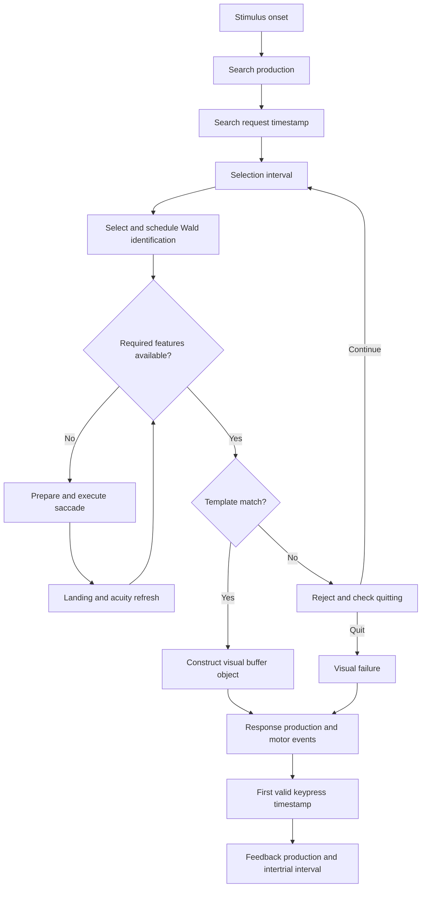

# Code walkthrough: gs-vision

This walkthrough describes the repaired implementation. The previous
September 5 walkthrough is preserved in the local baseline source archive.
See [the module API](../gs-vision/README.md) and [results](RESULTS.md).

## Architecture and load order

`load-gs-vision.lisp` loads the vendored ACT-R, EMMA, parameter/state classes,
priority functions, diffuser, eye functions, and module registration, in that
order. Registration replaces the vision module definition before a model
exists. Specialized CLOS methods delegate ordinary requests to stock vision.

## One trial

The experiment clears per-trial search state, centers gaze at its fixation
cross, adds a display, and arms the goal. The following event path defines
the measurement boundaries.

The diagram shows logical dependencies; multiple diffuser items and saccade
preparation can overlap. Selection remains inside the module rather than
being implemented as a production per item.

## Selection and recognition

`gs-compute-priority` stores a guidance value without eccentricity or sampled
noise as well as a noisy covert-selection priority. Guiding features are
color, orientation, size, and luminance. Shape participates only in the
identity comparison. Unavailable features contribute uncertainty to guidance.

`gs-select` uses Luce choice within the attentional field. A sufficiently
strong peripheral guidance candidate triggers a saccade. Other useful near
work can proceed during preparation. New selection pauses during execution.
Capacity constrains simultaneous Wald identification events.

`gs-item-decision` rejects a mismatch, waits for foveation when features are
missing, or finishes recognition. `gs-finish-hit` schedules an owned delivery
event. `gs-deliver-hit` checks that the target still exists and invokes the
stock `encoding-complete` construction and bookkeeping at the same simulated
time. Reset/cancellation deletes delivery so a stale object cannot enter a
later trial's buffer. A peripheral recognition does not relocate gaze.

## Eye records and stopping

`gs-close-fixation` records the position occupied over an interval and marks
the interval closed. Saccade execution closes it; landing opens another.
Hit, quit, reset, and timeout close an open interval without duplication.
Preparation is stationary time; execution is excluded. Logs end at visual
result, rather than at keypress or a later click.

The competitive denominator includes every item outside the IOR ring,
including pending identifications. Its guidance weights exclude noise and
eccentricity and cap beta at four. The adaptive threshold uses the persistent
scale times effective set size. At threshold, new selection pauses while
outstanding identifications finish. Existing feedback updates the persistent
scale, priming history, and prevalence window.

## Python and validation

`GSParams` mirrors modeled parameters and separately names the response and
protocol settings. Millisecond-valued settings are normalized before use.
`parameters.py` validates complete entries, translates them, verifies ACT-R
readback, and identifies the effective configuration. The hybrid uses the
same recognition, movement, and stopping contracts, with independent random
streams. `gs6_sim.py` remains the original simulation replication.

`human_data.py` retains every source trial and separates RT eligibility from
accuracy. Participant-level summaries define group means and quantiles;
bootstrap draws resample participants. `protocol.py` supplies the same display
sequence plan to both implementations, with practice flags and task-specific
state. `run_batch.py` records actual event times and keeps timeout rows.

`repair.py` fits training data, selects using independent validation runs,
freezes parameters, and simulates final seeds. `evaluate.py` verifies run
hashes and computes human comparisons and implementation agreement.
`report.py` replaces only its marked generated region, leaving narrative
untouched. Missing required inputs fail visibly.

## The gs6-vision variant

`gs6-vision/` is a second module folder that keeps this architecture and
replaces the Competitive Guided Search engine with Wolfe's posted Guided
Search 6 simulation: a two-bound diffuser stepped every 10 ms by
`gs-diffuser-tick`, an adaptive start point, the quit-signal diffuser with the
MATLAB's feedback rules, diffuser-only memory, and Guided Search 2's dual
orientation channels and best-channel top-down rule. Its mirror is
`reference/gs6_hybrid.py`, its driver `harness/gs6_fit.py`, and its results
are in [RESULTS-GS6-20260905.md](RESULTS-GS6-20260905.md). See
[gs6-vision/README.md](../gs6-vision/README.md) for the mechanism table.
