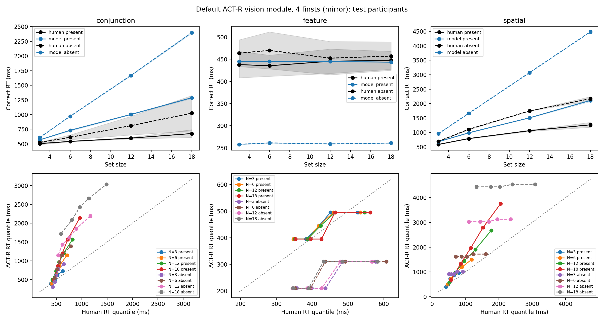
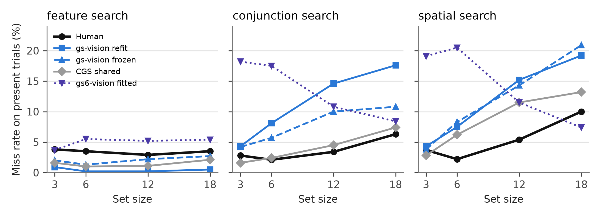

# Abstract

Cognitive models that interact with visual displays depend on ACT-R's vision module to locate and encode objects. However, the stock module's core search mechanisms have remained largely unchanged for more than two decades and do not represent visual acuity, feature-guided selection, eye position, or an adaptive decision to terminate an unsuccessful search. This paper's primary contribution is gs-vision, an extension of the ACT-R 7.31 vision module that integrates a Guided Search 6 priority map, Competitive Guided Search selection and identification, memory for rejected items, adaptive quitting, per-feature acuity, iconic memory, and EMMA eye movements. The tutorial explains the module's theoretical basis and provides a step-by-step guide to loading it, describing displays, issuing searches, collecting diagnostics, and fitting parameters from Python. We validate the module against reaction-time distributions and error rates from three benchmark visual-search tasks and compare it with stock ACT-R vision, PAAV, an ACT-R variant based on the posted Guided Search 6 engine, and six trial-level models fitted under the same evaluation protocol. On held-out participants, the exploratory gs-vision refit obtained a mean cell quantile RMSE of 100.1 ms, compared with 122.5 ms for the next-best ACT-R vision module and 80.5 ms for the best trial-level model. Thus, gs-vision provides the most accurate ACT-R vision-module account in this benchmark, but it is not the best model of every outcome: its miss rates and saccade amplitudes remain important limitations. The module, validation code, and run records are publicly available.

*Keywords:* ACT-R, visual search, Guided Search, cognitive architecture, eye movements, model validation, reaction time distributions

# Introduction

Cognitive architectures are computational theories that describe how perceptual, cognitive, and motor mechanisms work together to produce behavior (Anderson, 2007; Anderson et al., 2004; Newell, 1990). ACT-R is particularly useful for human–computer interaction because its models can inspect a display, move attention and the eyes, retrieve knowledge, and produce motor responses with explicit predictions about time and error (Byrne, 2001; Salvucci, 2001). These capabilities have enabled ACT-R models to explain behavior in menus, complex displays, and other interactive tasks. However, the quality of those predictions depends on how the architecture represents the search for task-relevant information.

The stock ACT-R vision module provides a reliable symbolic interface between a model and a display. A model can request an object with a specified color, value, or location, shift attention to the selected location, and encode the object. The module was not designed, however, as a current theory of visual search. Its core search operations do not include eccentricity-dependent acuity, salience-based competition, graded guidance by target features, a representation of eye position in selection, or an adaptive rule for deciding that a target is absent. Modelers can create a production loop that locates, attends to, and tests one object at a time, but each iteration includes production and encoding costs that are substantially slower than human item-processing rates in many visual-search tasks (Fleetwood & Byrne, 2006; Wolfe et al., 2010).

Research on visual search has developed several mechanisms that can address this gap. Guided Search describes selection through a priority map that combines bottom-up salience, top-down target guidance, selection history, value, and scene structure (Wolfe, 1994, 2021). Guided Search 6 further includes capacity-limited identification, memory for rejected items, functional visual fields, and adaptive quitting. Competitive Guided Search (CGS; Moran et al., 2013) provides a quantitative account of selection, identification, and quitting that reproduces benchmark RT distributions and error rates. Related fixation-based and active-vision accounts show that acuity and eye movements also shape search efficiency (Hulleman & Olivers, 2017; Kieras & Hornof, 2014; Kieras & Meyer, 1997).

Earlier work has brought parts of these ideas into ACT-R. The Pre-Attentive And Attentive Vision module (PAAV; Nyamsuren & Taatgen, 2013) added eccentricity-dependent acuity, iconic memory, a Guided Search activation map, and a rule for terminating search. Other proposals added salience-based selection to ACT-R location requests (Byrne, 2006; Wiese et al., 2019). These contributions demonstrated that ACT-R's visual interface can be extended, but they preceded ACT-R 7 or did not evaluate full RT distributions and error rates across searches with different efficiencies. The stock ACT-R 7 vision module therefore still lacks an integrated, quantitatively validated account of current visual-search mechanisms.

This limitation matters beyond laboratory visual search. An ACT-R model that interacts with a menu, cockpit, air-traffic display, spreadsheet, or web page must find information before it can use that information. When search time is represented as a fixed encoding delay or an unconstrained symbolic request, the model cannot predict how target–distractor similarity, eccentricity, set size, eye position, or target prevalence changes performance. A more complete vision module can connect display design to predicted search behavior while preserving the cognitive and motor mechanisms already represented in ACT-R.

In this paper, we address this limitation by presenting gs-vision, an extension of the ACT-R 7.31 vision module. The module combines Guided Search 6 as its organizing framework, CGS as its quantitative selection and identification engine, EPIC- and PAAV-style acuity and iconic memory, and EMMA eye movements. It retains the stock buffers and requests and adds a full-search request that runs the item-level search process within the module. The included compatibility tests verify unchanged traces for the ACT-R tutorial models used in the test suite when gs-vision is enabled or disabled.

This tutorial addresses three research questions:

1. Can current visual-search mechanisms be integrated into ACT-R while preserving the stock vision interface for existing models?
2. Does gs-vision simulate benchmark visual-search RT distributions more accurately than existing ACT-R vision modules under a common evaluation protocol?
3. How can cognitive modelers use the module to represent search in laboratory and applied tasks, inspect its predictions, and fit it to behavioral data?

The paper makes three contributions. First, it provides a working ACT-R vision module that connects feature guidance, acuity, eye movements, identification, memory, and quitting in one event-driven process. Second, it provides a practical workflow for loading the module, describing displays, issuing searches, logging model behavior, and fitting parameters. Third, it evaluates the module against held-out participants from three visual-search benchmarks and compares it with the stock ACT-R module, PAAV, an ACT-R Guided Search 6 variant, and six trial-level models under the same objective. The evaluation also reports where the module fails, because those limitations define the appropriate scope of its current use. All reported analyses and tables can be regenerated from the public repository.

# Limitations of the stock ACT-R vision module

The stock vision module (ACT-R 7.31.4, `vision.lisp` version 11.1; Bothell, n.d.) maintains a *visicon*, a list of feature chunks that the experiment adds with `add-visicon-features`. A `visual-location` request specifies slot constraints such as `color red` or `:attended new`, optional ordinal constraints such as `screen-x lowest`, and a `:nearest` option. The module returns one matching chunk in 0 ms, breaking ties by recency of onset and then at random. A `visual` request with `move-attention` shifts attention to that location and, after `:visual-attention-latency` (85 ms), places an object chunk in the `visual` buffer. Four *finsts* mark recently attended objects for three seconds, so that `:attended nil` can exclude them. These are the stock module's search primitives. Table 1 summarizes their timing in a model that uses three productions to find, attend to, and test each candidate object.

**Table 1**

*Per-item timing of the stock vision module in a find, attend, test production loop*

| Component | Latency | Source |
|---|---|---|
| Production cycle | 50 ms each, three per item | Default `:dat` |
| `visual-location` request | 0 ms | Vision module |
| Attention shift and encoding | 85 ms | `:visual-attention-latency` |
| Total per item | 185–235 ms | Sum; 135 ms with `:auto-attend` |
| Human, conjunction search | 10–35 ms per item | Wolfe et al. (2010) |
| Human, spatial-configuration search | 45–100 ms per item | Wolfe et al. (2010) |

This production loop has three consequences. First, it is three to ten times slower per item than human guided or spatial search. A direct request such as `color red` can avoid this cost, but it then returns a matching object without simulating the search process and produces target-absent responses in approximately 210 ms, about half the human value in the benchmark. Second, when several objects satisfy the request, the stock module does not rank them by their similarity to the target. Third, the module has no search-specific quitting rule. With four finsts and more than four objects, an absent trial requires an additional counting or memory strategy to terminate reliably. The model comparison below quantifies these limitations. EMMA (Salvucci, 2001), the eye-movement extension distributed with ACT-R, represents when and where the eyes move after a location has been chosen; it does not determine which location wins the search competition.

PAAV (Nyamsuren & Taatgen, 2013) replaced the location process with an `abstract-location` buffer served by iconic memory, eccentricity-dependent acuity, a Guided Search 4 activation map, and a pruning rule that lets a model report target absence without fixating every object. It reproduced conjunction slopes of approximately 20 ms per item for present trials and 54 to 73 ms per item for absent trials, as well as fixation counts in a comparative-search task. PAAV nevertheless selects one item per fixation, ties the item slope to the saccade rate, has no adaptive quitting mechanism for modeling prevalence and miss rates, and was developed for ACT-R 6. It was also not evaluated against full RT distributions and error rates. gs-vision builds on PAAV's acuity, iconic-memory layer, and integration pattern while replacing its selection, identification, and quitting processes. Because the original PAAV implementation does not load under ACT-R 7, the comparison uses a display-level mirror transcribed from its source code; we report this limitation with the corresponding results.

# The gs-vision module

## Theory

gs-vision implements Guided Search 6 (Wolfe, 2021) as the organizing architecture, Competitive Guided Search (Moran et al., 2013) as the arithmetic of selection, identification and quitting, EPIC-style acuity (Kieras & Meyer, 1997) with PAAV's iconic memory for what is visible from where the eye is, and EMMA (Salvucci, 2001) for saccades. Figure 1 shows the pieces and the one-trial flow between them. Table 2 lists the equations.


*Priority map.* Every item in iconic memory receives a priority that is a weighted sum of bottom-up salience (local contrast in categorical feature channels, divided by inter-item distance, as in Guided Search 2), top-down guidance (categorical channel match to the guiding template; features that are not yet visible contribute an uncertainty term), a history term (priming traces per feature value decaying over about ten seconds), an optional value term and an optional scene prior, minus inhibition of return for recently rejected items, plus logistic noise. Guidance is restricted to *guiding features* (by default color, orientation, size, and luminance); every other feature, and shape above all, is compared only once an item is inside the identification stage. That one rule is what makes feature search efficient and spatial-configuration search inefficient with a single set of mechanisms.

*Covert selection and identification.* Every 50 ms, while a search is active and the identification stage has capacity (five items), the module selects one item by a Luce choice over the noisy priorities of the items inside the attentional functional visual field (8 degrees by default). Each selected item is identified after a Wald-distributed time (drift and threshold as in CGS), which completes when the item's required features are available at the current eye position; if they are not, the item waits for a saccade. A match ends the search with a hit; a mismatch rejects the item, adds it to the inhibition-of-return ring, and increments the quit unit.

*Quitting.* Two rules race. The competitive rule of CGS quits with probability equal to the quit weight divided by the sum of the quit weight and the guidance weights of every unresolved item, evaluated after every rejection. The adaptive rule of Guided Search 6 maintains a threshold scale that multiplies the effective set size; when the number of rejections reaches it, new selection pauses, outstanding identifications drain, and the search quits. Feedback after each trial lowers the scale after a correct rejection and raises it after a miss, with the prevalence-scaled step of the posted Guided Search 6 simulation, and updates a running prevalence estimate.

*Eyes.* A saccade is triggered when an item outside the attentional field carries guidance that exceeds the best item inside it by a margin, or when nothing selectable remains inside it; the destination is chosen from the exploratory field (12 degrees) by guidance minus a distance penalty. Preparation, execution (20 ms plus 2 ms per degree), and landing noise follow EMMA. On landing, acuity is re-evaluated: each feature of each item is available with a probability given by the EPIC rule, item size compared with a threshold that grows linearly with eccentricity and has a per-feature slope, and available features are written into an iconic memory that persists for four seconds.

**Table 2**

*Core equations of gs-vision*

| Mechanism | Equation | Origin |
|---|---|---|
| Availability of feature *f* of item *i* | P(size~i~ > N(θ~f~ · e~i~, σ)) | EPIC (Kieras & Meyer, 1997), PAAV |
| Priority | P~i~ = w~BU~BU~i~ + w~TD~TD~i~ + w~H~H~i~ + w~V~V~i~ + w~S~S~i~ − IOR~i~ + ε~i~, ε logistic | Guided Search 2 and 6 |
| Selection | p(i) = exp(βP~i~) / Σ~j~ exp(βP~j~), items inside the attentional field | CGS (Luce choice) |
| Identification time | Wald(μ, θ); mean θ/μ | CGS |
| Competitive quit | p(quit) = w~q~ / (w~q~ + Σ~unresolved~ w~j~), w~q~ += Δ per rejection | CGS |
| Adaptive quit | rejections ≥ scale × N~eff~; scale −= step after a true negative, += step / (2 · goal · prevalence) after a miss | Guided Search 6 |
| Saccade duration | 20 ms + 2 ms/deg, plus preparation and landing noise | EMMA |

## Design decisions

Four decisions were necessary to put this architecture into ACT-R, and each is a commitment a user should know about.

*The item-level loop runs inside the module.* Productions fire every 50 ms, which coincidentally matches Guided Search's selection rate but not its identification or fixation rates, and production overhead plus the 85 ms shift makes production-driven item search several times too slow. The declarative module set the precedent: retrieval is sub-symbolic and internal, and productions only request and receive. gs-vision does the same for search. A production sets the template; the module runs selection, identification, saccades and quitting on its own scheduled events; the target object arrives in the `visual` buffer, or the buffer is left empty with `state error`, exactly like a retrieval failure.

*It is a subclass, not a fork.* The module class inherits from `vision-module`. The `:vision` module is undefined and redefined with the same buffer names and every stock parameter, which is rebuilt from the live parameter table rather than copied from `vision.lisp`. Ordinary requests are delegated to the stock methods. This design preserves the connections to the motor module, AGI devices, the Environment, and EMMA. The included backward-compatibility test runs the ACT-R tutorial unit 2 and unit 3 models under the stock module and under gs-vision, both enabled and disabled, and requires identical traces line by line. This test provides evidence for compatibility with the tested interface; it does not establish compatibility with every ACT-R model.

*The response stage is measured, not fitted.* The model presses a key with ACT-R's motor module. The keyboard response stage was measured from the module (160 ms for a repeated key, 260 ms for a switch, 310 ms for the first response of a block) and held fixed in every fit. The trial-level models in the Comparison section fit their own non-decision times; gs-vision never did.

*One model run is one simulated observer.* The adaptive threshold, the priming traces and the prevalence window persist across trials, so an experiment must clear per-trial state with `gs-reset-search`, not with `reset`.

## Implementation

The module contains approximately 2,000 lines of Common Lisp in five files (Table 3). A modeler loads `load-gs-vision.lisp` after ACT-R and EMMA and before defining a model. A Python mirror (`reference/gs_hybrid.py`) implements the same mechanisms with independent random streams. We use this mirror for parameter fitting because it can run in parallel processes, and we compare it with the Lisp module on identical displays after implementation changes. The validation section reports this Lisp–mirror agreement. A Python harness drives ACT-R through its remote interface, generates displays, records event times, fits parameters, and evaluates runs against human data.

**Table 3**

*Files of the module and the harness*

| File | Contents |
|---|---|
| `gs-vision/gs-params.lisp` | Module class, item records, every `:gs-*` parameter with its validator |
| `gs-vision/gs-priority.lisp` | Feature channels, priority map, Wald and logistic samplers |
| `gs-vision/gs-diffuser.lisp` | Covert selection, identification, both quit rules, feedback |
| `gs-vision/gs-eye.lisp` | Acuity, iconic memory, functional visual fields, saccades |
| `gs-vision/gs-vision.lisp` | Creation, reset, request and query dispatch, module registration |
| `models/search-model.lisp` | The benchmark model used in this paper (listed in the Tutorial) |
| `reference/gs_hybrid.py` | Python mirror used for fitting and parity checks |
| `harness/` | Display generation, ACT-R driver, human data import, fitting, evaluation, reports |
| `tests/` | 115 Lisp event assertions; reference, compatibility and validation tests in Python |

# Tutorial: using gs-vision in a model

This section shows how to add gs-vision to a cognitive model and use it in an experiment. The example is the same model used for the ACT-R results reported below. To reproduce it, install ACT-R 7.31.4, Steel Bank Common Lisp, and the Python dependencies listed in `requirements.txt`. The repository does not distribute ACT-R itself; the setup instructions identify the required version and download location.

## Step 1: Load the module

The module must be installed before any model is defined, because a module cannot be undefined once a model exists.

```console
sbcl --load gs-vision/load-gs-vision.lisp
```

Inside a model, two parameters turn the pieces on. With `:gs-enabled nil` the new requests are refused and the module behaves as the stock one, which is useful for ablations.

```lisp
(sgp :emma t :gs-enabled t)
```

## Step 2: Describe the display

Displays are added exactly as before with `add-visicon-features`. The module defines a chunk-type `gs-feature` that includes `visual-location` and adds the continuous slots `hue` (0–360), `orient` (degrees, 0 vertical), `lum` (0–1) and the categorical slot `shape`. Only the slots a modeler needs must be given: `color` is used when `hue` is absent, and `size` (in square degrees) is derived from `width` and `height` when it is absent. The listing below is what the harness sends for a red vertical bar, a green vertical bar and a digit.

```lisp
(add-visicon-features
  '(isa (gs-feature) screen-x 512 screen-y 300 kind bar color red value bar
        shape bar hue 0 orient 0 lum 0.5 width 20 height 60 size 0.7)
  '(isa (gs-feature) screen-x 700 screen-y 420 kind bar color green value bar
        shape bar hue 120 orient 0 lum 0.5 width 20 height 60 size 0.7)
  '(isa (gs-feature) screen-x 300 screen-y 500 kind digit color white value two
        shape two hue 0 orient 0 lum 1.0 width 30 height 40 size 0.6))
```

Two slots are available for models with a pixel front end: `salience` replaces the module's internal bottom-up computation with an externally computed value, and `prior` supplies a scene prior. Both enter the priority map with their own weights.

## Step 3: Issue a search

The full search is one request. The slots name the template; the module decides which of them guide (by default color, orientation, size and luminance) and which are compared only after selection. Options restrict guidance to named slots or select the quitting rule.

```lisp
+visual> isa gs-search color red orient steep      ; conjunction search
+visual> isa gs-search shape two                   ; no guiding feature: spatial search
+visual> isa gs-search color red guide color       ; restrict guidance to color
+visual> isa gs-search color red stop cgs          ; adaptive | cgs | both (default)
```

Channel names such as `steep`, `shallow`, `red` and `small` are categorical, following Guided Search; a numeric value is mapped to the channel it falls in. The result arrives in the `visual` buffer as an ordinary visual object, or the search quits and the buffer is left empty with `state error`. A model therefore branches on two buffer tests, exactly as it does for retrievals:

```lisp
(p respond-present
   =goal> isa trial state searching
   =visual>
   ?manual> state free
   ==>
   +manual> cmd press-key key "j"
   -visual>
   =goal> state responded)

(p respond-absent
   =goal> isa trial state searching
   ?visual> state error
   ?manual> state free
   ==>
   +manual> cmd press-key key "f"
   =goal> state responded)
```

For models that want to keep their own production loop, a guided location request exists as well. It ranks the visicon by the priority map instead of choosing at random and costs one selection interval rather than 0 ms; the usual filters (`screen-x`, `:nearest`, `:attended`) still apply.

```lisp
+visual-location> isa visual-location color red orient steep :guided t
```

## Step 4: Report the outcome

Adaptive quitting and priming need to know how the trial ended. The observer cannot know whether its response was correct, so the experiment tells it, and a production passes the outcome to the module after the keypress. This production is outside RT.

```lisp
(p report-outcome
   =goal> isa trial state responded outcome =o
   ?visual> state free
   ==>
   +visual> isa gs-feedback outcome =o          ; hit | miss | fa | tn
   =goal> state waiting outcome nil)
```

## Step 5: Read the diagnostics

Every selection, decision, saccade, fixation, quit and feedback is a trace event at `:output medium`, so it appears in the standard trace and in the Environment:

```
GS-SEARCH start template (COLOR RED ORIENT STEEP) n-eff 6. qt 1.00
GS-SELECT VISICON-ID2 priority 1.415
GS-DECIDE VISICON-ID2 reject
GS-SACCADE 512. 384. -> 700. 500. amp 11.0
GS-FIXATE 706. 495.
GS-DECIDE VISICON-ID9 hit
GS-FEEDBACK HIT qt 1.000 prevalence 0.50
```

Commands expose the same information to a harness: `gs-search-stats` returns fixations, rejections, elapsed time and the quit reason for the last search; `gs-fixation-log` returns stationary intervals as `(time x y duration)`; `gs-event-log` returns every timestamped event; `gs-state` returns the threshold scale, the prevalence estimate and the feedback count. `gs-reset-search` clears per-trial state between trials while preserving learning, and `gs-benchmark-gaze` places the eye at a fixation cross without charging time, as an experiment's fixation cross does.

## Step 6: Drive the experiment from Python

The repository's harness uses ACT-R's own remote interface (the `actr.py` client shipped with the tutorial). One trial is: reset the search, place the gaze, add the display, arm the goal, run until the keypress, then send feedback. The listing below is the core of `harness/run_batch.py`.

```python
actr.call_command("gs-reset-search")
actr.call_command("gs-benchmark-gaze", cx, cy)
actr.add_visicon_features(*display.visicon_features())
actr.call_command("gs-trial-setup", task, color, orient, shape)
actr.run(10)                                   # stops at the keypress monitor
outcome = score(display, key_pressed)
actr.call_command("gs-trial-feedback", outcome)
actr.run(2)                                    # feedback production and intertrial interval
stats = actr.call_command("gs-search-stats")
fixations = actr.call_command("gs-fixation-log")
```

`gs-trial-setup` and `gs-trial-feedback` are two Lisp functions defined at the bottom of the model file and registered as remote commands; they write the trial's template and outcome into the goal chunk. RT is measured from stimulus onset to the first valid keypress, recorded by a keypress monitor; the return of the event loop is about 90 ms later and is never used as RT.

## Step 7: Fit parameters

The module's search parameters are set with `sgp` and mirrored one-to-one in the Python `GSParams` record. The harness validates a complete configuration, sends it to ACT-R, reads every value back, and hashes the accepted values into the run record, so that a run can always be traced to the parameters it actually used. Fitting uses differential evolution (Storn & Price, 1997) on the mirror with the objective of the Validation section, and the selected configuration is then run in ACT-R at fresh seeds. The commands that reproduce the paper's fits are in the Open Practices section.

Table 4 lists the parameters a modeler is most likely to touch. The complete list, with the stock vision parameters that continue to work, is in the module's README.

**Table 4**

*Principal gs-vision parameters*

| Parameter | Default | Role |
|---|---|---|
| `:gs-guiding-features` | `(color orient size lum)` | Features that may guide selection; all others are identification-only |
| `:gs-select-interval` | 0.050 s | Time between covert selections |
| `:gs-diffuser-capacity` | 5 | Items identified at once |
| `:gs-choice-beta` | 4.0 | Luce temperature on priorities |
| `:gs-id-drift`, `:gs-id-threshold`, `:gs-id-sigma` | 0.25, 0.03, 0.1 | Wald identification: mean θ/μ, noise σ |
| `:gs-id-error` | 0.0 | Probability that an identification decision flips |
| `:gs-quit-delta` | 0.02 | Competitive quit weight per rejection |
| `:gs-qt-init`, `:gs-qt-step`, `:gs-error-goal` | 1.0, 0.05, 0.08 | Adaptive quitting |
| `:gs-memory` | 4 | Inhibition-of-return ring size |
| `:gs-attn-fvf`, `:gs-explore-fvf` | 8, 12 deg | Attentional and exploratory fields |
| `:gs-saccade-margin`, `:gs-saccade-trigger` | 0.25, 0 deg | When a peripheral item pulls the eye |
| `:gs-acuity-theta` | color .10, orient .20, shape .40, size .20, lum .10 | Acuity slope per feature |
| `:gs-w-bu`, `:gs-w-td`, `:gs-w-h`, `:gs-w-v`, `:gs-w-s` | 0.5, 1.0, 0.3, 0, 1.0 | Priority-map weights |
| `:gs-noise` | 0.2 | Logistic noise on priorities |
| `:gs-priming-tau` | 10 s | Decay of feature priming |
| `:gs-iconic-span` | 4 s | Persistence of a feature in iconic memory |
| `:gs-value-hook` | `nil` | Function or remote command supplying a value term per location |

# Validation against benchmark human data

## Data

Wolfe et al. (2010) published trial-level RTs and accuracy for three tasks that span the range of search efficiency: a feature search (red vertical target among green vertical bars), a color-by-orientation conjunction search (red vertical among red horizontal and green vertical), and a spatial-configuration search (a digit 2 among 5s), each at set sizes 3, 6, 12 and 18, target present on half the trials, with 9, 10 and 9 observers who each completed about 4,000 trials. The archive contains 111,777 trials, and the harness's importer retains every one of them, records the SHA-256 of each source file, and fails on any malformed line. Following the source paper's methods, RT analyses use correct trials between 200 and 4,000 ms (feature, conjunction) or 200 and 8,000 ms (spatial), and accuracy uses every validated trial. Participants are weighted equally; a cell's human quantile is the mean over participants of that participant's quantile.

## Protocol

Participants were split within each task into training, validation and test groups of 5/2/2 (feature), 6/2/2 (conjunction) and 5/2/2 (spatial) with a fixed seed, before any model was fitted. Parameters were fitted on the training participants, candidates were selected on the validation participants with fresh seeds, the selection was frozen, and the frozen model was then run in ACT-R with two further seeds at 1,000 retained trials per cell (2,000 per cell in total, 24 cells per split) and scored once against the test participants. The fitting objective was the mean over the 24 cells of the RMSE between model and human RT quantiles at .1, .3, .5, .7 and .9, plus 1,000 ms times the absolute difference in error rate, plus a penalty for trials that timed out. Simulated observers ran the experiment as the human observers did: 30 practice trials before each 300-trial block, accuracy feedback after each keypress, a two-second interval before the next display, and a fixation cross at which gaze was placed before each trial. Because the source files do not contain item coordinates, displays reproduce the published geometry with random placement.

The report of every run states three summary numbers: mean cell quantile RMSE (ms), the number of the six RT-by-set-size slopes (three tasks by present and absent) that fall within 5 ms per item of the human slope, and the largest miss-rate error in percentage points. Targets set before the work were 40 ms, 6 of 6, and 3 points. The Lisp module and the Python mirror were compared on identical displays in every cell with a Bonferroni-corrected z-test on search time; the frozen run has 0 of 24 exceedances with a maximum |z| of 1.47.

## Results of the frozen fit

The primary fit shares all settings across the three tasks; the module therefore has to derive the differences between tasks from the displays and the templates alone. Six parameters were fitted (identification threshold, inhibition-of-return memory, selection interval, bottom-up weight, attentional field, competitive quit increment) with a small differential-evolution search (four generations of 18, 72 evaluations). Table 5 gives the frozen results on all three splits, together with the module at its defaults and with the exploratory refit described next.

**Table 5**

*gs-vision runs in ACT-R against the human splits (2,000 retained trials per cell, no timeouts)*

| Run | Fitted parameters | Split | Mean RT RMSE (ms) | Quantile RMSE (ms) | Slopes within 5 ms/item | Largest miss error (points) |
|---|---|---|---|---|---|---|
| Module defaults | 0 | train | 465.9 | 351.9 | 3/6 | 11.5 |
| Module defaults | 0 | validation | 593.4 | 411.1 | 5/6 | 15.6 |
| Module defaults | 0 | test | 529.1 | 365.4 | 3/6 | 12.4 |
| Frozen shared fit | 6 | train | 160.7 | 151.5 | 3/6 | 10.1 |
| Frozen shared fit | 6 | validation | 123.7 | 143.1 | 5/6 | 16.5 |
| Frozen shared fit | 6 | **test** | **108.0** | **127.7** | **2/6** | **10.9** |
| Refit (exploratory) | 13 | train | 60.0 | 65.7 | 5/6 | 13.2 |
| Refit (exploratory) | 13 | validation | 191.6 | 173.3 | 2/6 | 14.7 |
| Refit (exploratory) | 13 | test | 102.5 | 100.1 | 4/6 | 11.3 |

The frozen model reproduces the qualitative structure of the benchmark: flat feature-search functions, a conjunction slope near the human value on absent trials, and spatial-configuration slopes that rise with set size on both trial types, with absent RTs about twice present RTs. Its quantitative misses on the test participants are a feature search that is 60 to 110 ms too fast throughout, a conjunction absent function that is too steep (39 versus 33 ms per item) and starts too late, spatial-configuration slopes that are too shallow (78 and 32 versus 98 and 45 ms per item), and miss rates that rise too steeply with set size in conjunction and spatial search (10.8 and 20.9 percent at set size 18 against 6.3 and 10.0). It produces no false alarms at all, because identification in this version is a timer rather than a decision.

## An exploratory refit

The frozen run's own trial and fixation logs identified six causes for those misses: a 130 ms fast edge (a 50 ms request latency, about 40 ms of identification, and the fastest keypress); an identification noise that was a fixed constant, forcing a coefficient of variation of 1.3 on every identification; a mandatory saccade at small set sizes in spatial search, because shape was resolvable only within about four degrees; an adaptive quit controller that had drifted to fifty times its starting scale and never bound, so that every miss came from the competitive rule; the structural impossibility of false alarms; and saccades that exceeded the attentional field because the covert loop exhausted the field before the eye moved. Six parameters were added to address them (Table 4: `:gs-id-sigma`, `:gs-id-error`, `:gs-onset-latency`, `:gs-adaptive-quit-delta`, `:gs-explore-proximity`, `:gs-saccade-trigger`), all defaulting to the frozen behavior so that the frozen results are unchanged, and thirteen parameters were refitted with a larger search (2,418 evaluations). Because the frozen test results had been inspected before this refit, it is exploratory, and Table 5 labels it so.

The refit improves the test fit from 127.7 to 100.1 ms, passes four of six slopes, and meets the 40 ms quantile target in seven of eight feature-search cells; conjunction absent cells improve two- to three-fold (Figure 2). It does not improve the miss rates, and on the validation participants it is *worse* than the frozen fit (173 versus 143 ms). The reason is instructive for anyone fitting group data with few participants: the two validation participants in spatial search are 20 percent faster than the training group, and the two in feature search 25 percent faster, while the two in conjunction search are slower. A model fitted to the training participants' speed loses on validation; the frozen fit had undershot the training participants by about the same amount and matched validation by accident. With two participants per split, validation selection decides which pair of people the model resembles, which is why every candidate is reported on every split.


## Mechanism evidence: ablations

Fixed-parameter ablations at the frozen settings (seeds 321 and 322, 1,200 trials per cell) isolate what the eye and quitting policies contribute (Table 6). Restoring a second full encoding after identification, the behavior of the stock module, adds 43 to 49 ms to present trials. Reverting the saccade policy to guidance-only destinations with no margin and no distance penalty raises the spatial fixation count from 6.1 to 12.9 per trial and spatial absent RT from 2.5 to 4.4 s, and produces the only timeouts seen in the project. Raising the bottom-up weight from 0.5 to 3.0, which improves the capture effect reported below, raises conjunction absent RT from 1.1 to 2.8 s and the fixation count from 2.5 to 6.4, which is why the default was not promoted.

**Table 6**

*Ablations at the frozen settings (mirror; conjunction and spatial absent trials)*

| Configuration | Conjunction absent RT (ms) | Spatial absent RT (ms) | Spatial fixations per trial |
|---|---|---|---|
| Frozen policies | 1,146 | 2,510 | 6.1 |
| Extra recognition delay restored | 1,146 | 2,510 | 6.1 |
| Old saccade policy | 1,707 | 4,417 | 12.9 |
| Old quit weights | 1,192 | 3,218 | 6.1 |
| Bottom-up weight 3.0 | 2,812 | 2,510 | 6.1 |
| Threshold step 0.005 | 973 | 2,116 | 6.1 |

## Eye movements

The benchmark has no eye data, so the module's fixations were compared with the human values collected by Wu and Wolfe (2022) in a T-among-L foraging task whose data are on the Open Science Framework, with the caveat that foraging episodes and keypress search windows are not the same measurement. The human participant averages are 16.0 fixations per episode, 249 ms per fixation, 5.4 degree saccades, and a 9.5 percent refixation rate. The frozen gs-vision run produces stationary durations of 125 ms (feature), 186 ms (conjunction) and 142 ms (spatial), 4.6 fixations per spatial trial, and saccade amplitudes of 11.6 to 13.6 degrees; the refit lengthens the durations to about 200 ms in feature and conjunction search but leaves the amplitude at about 12 degrees. Fixation durations are therefore short and saccades are twice too long. The amplitude problem is structural: the covert loop clears the attentional field before the eye moves, so the next saccade goes to the best remaining item wherever it is. A saccade trigger that lets the eye start moving while covert selection continues was one of the refit's additions; the fits did not choose it strongly enough to fix the amplitude. Scanpath similarity to the human data (ScanMatch, MultiMatch) could not be computed for a matched experiment, because the foraging data lack the stimulus rotations and onset timestamps that a matched simulation needs; the human split-half consistency values are reported in the repository as the ceiling such a comparison would face.

## Secondary phenomena

Three effects that a Guided Search model should produce were tested at the frozen settings (Table 7). *Attentional capture* by an irrelevant salient singleton (the additional-singleton paradigm; Adam et al., 2021) costs the model 7.6 ms in ACT-R at the default bottom-up weight and 23 ms at a weight of 3, against 39 ms in the human data; the model's analogue uses an orientation target where the human study used a shape target, so this is a calibration, not a replication. *Priming of pop-out* (Maljkovic & Nakayama, 1994) is not established: repeat-minus-switch differences are within a few milliseconds at the frozen priming weight, and removing the history term changes them by 22 ms in the wrong direction because the history term also carries distractor priming. *Prevalence* (Wolfe et al., 2005) fails: at 10 percent target prevalence the model's misses rise by only 1.5 points and its absent responses *slow* by 87 ms, where human observers miss far more often and respond "absent" faster. This is a property of the posted Guided Search 6 feedback rules, which the module reproduces faithfully: with a true-negative step proportional to prevalence and a miss step inversely proportional to it, the controller's equilibrium miss rate is twice the error goal times the prevalence, which falls as prevalence falls. The same failure appears in a line-by-line Python port of Wolfe's MATLAB.

**Table 7**

*Secondary manipulations at the frozen settings (ACT-R runs; 95% intervals over simulation seeds)*

| Effect | Model | Human reference |
|---|---|---|
| Singleton capture cost, bottom-up weight 0.5 | 7.6 ms [2.5, 12.7] | 39.4 ms [31.6, 48.0] (Adam et al., 2021) |
| Singleton capture cost, bottom-up weight 3.0 | 23.0 ms [21.7, 24.2] | same |
| Priming of pop-out, switch minus repeat | −2.9 ms [−10.0, 4.2] | 20–60 ms (Maljkovic & Nakayama, 1994) |
| Prevalence 10% vs 50%, change in misses | +1.5 points [1.3, 1.7] | +20 to +25 points (Wolfe et al., 2005) |
| Prevalence 10% vs 50%, change in absent RT | +87 ms [77, 98] | faster |

# Comparison with other models

A prospective user needs to know whether the added mechanisms improve accuracy relative to the available alternatives. We therefore scored 18 model configurations from 11 model families using the same participants, splits, trimming rules, objective, and evaluation code (Tables 8 and 9; Figure 3). The comparison was conducted after the frozen test results had been inspected and is therefore exploratory. The ACT-R rows include direct runs of gs-vision and gs6-vision, a timing mirror of the stock module, and a display-level mirror of PAAV. The trial-level rows are implementations of published model families in `reference/baselines.py`. We fitted these models to the training participants with differential evolution (Storn & Price, 1997; 60 generations, a population of 8 per dimension, and 200 trials per cell) and evaluated two fresh seeds with 1,000 trials per cell.

## gs-vision

gs-vision is the focal model developed in this paper. It is an ACT-R vision module that operates on item locations and features, combines bottom-up salience and top-down guidance in a priority map, selects and identifies several items covertly, remembers rejected items, and races competitive and adaptive rules for ending an unsuccessful search. Per-feature acuity and iconic memory determine what information is available at each eye position, and EMMA supplies saccade timing and landing variability. The model returns a visual object to the ACT-R production system, which then makes the response through ACT-R's motor module. Tables 8 and 9 show three configurations of this same architecture: the unchanged module defaults, the prospectively frozen six-parameter fit, and the exploratory 13-parameter refit.

## Stock ACT-R vision module

The stock ACT-R module was driven by the ordinary find, attend, test loop with the same measured response stage. With its defaults (four finsts, 85 ms attention shift, three productions per item, a counting strategy so that absent trials terminate) its conjunction search runs at 47 to 57 ms per item present and 118 ms per item absent (human 11 and 33), its spatial search at 94 to 119 and 235 ms per item (human 45 and 98), and its feature search answers "absent" in 210 ms; its quantile RMSE on the test participants is 501 ms (Figure 4). Letting its attention latency, production count, finst count and response times vary brings it to 137 ms, and does so by driving the attention latency to 6 ms and the finst count to 19, which is no longer the stock module. These rows are a mirror of the module's documented timing rather than a run in ACT-R, and the mirror reproduces that timing exactly in a unit test.

## PAAV

PAAV was scored the same way, because it runs only on ACT-R 6 and porting its 7,000 lines to the current visicon, device and module interfaces was out of scope. Its mirror in `reference/baselines.py` transcribes the mechanisms of the posted source (`paav-visual-module`, version 0.98e): per-feature acuity (a feature of an item of size *s* at eccentricity *e* is visible when *s* > *a~f~e*^2^ − *b~f~e*, with the posted *a* and *b* per feature and the noise term disabled as in the source), iconic memory with four-second persistence, bottom-up activation as binary feature dissimilarity over one plus the square root of the pixel distance, top-down activation of 1, 0.5 or 0 per template feature for a match, an invisible feature, or a mismatch, selection of the highest 1.1·BU + 0.45·TD + noise among unattended items, permanent attended marks, the visual decision threshold that prunes candidates no farther from gaze than the last attended object whose top-down activation does not exceed it and declares absence when nothing remains, saccades of 20 ms plus 2 ms per degree with landing noise, 50 ms encoding, and three 50 ms productions per item. It runs on the same displays as gs-vision, so acuity and distance act on it as they do on the module. There is no Lisp implementation to check it against, which is the caveat that distinguishes these rows from the gs-vision rows. With the posted values PAAV scores 383 ms on the test participants. Feature search fits (71 ms; the threshold rule quits after one fixation on absent trials), but conjunction absent slopes are three times the human value (94 versus 33 ms per item), spatial-configuration search is nearly efficient (5 and 23 versus 45 and 98 ms per item), because shape is resolvable within about nine degrees and the binary contrast rule makes the 2 pop out among 5s, and it misses 10 percent of targets in feature and spatial search, because items in the corners of a 22.5 degree field have no visible feature from the fixation cross and are not in iconic memory when the search quits. Fitting nine parameters (noise, the two map weights, encoding time, production count, an acuity scale and the response stage) brings it to 275 ms; the fit does so by removing bottom-up activation (weight 0.03) and raising noise, which repairs conjunction search (28 ms per item absent) and the miss rates but leaves spatial search at 6 and 14 ms per item, and 3.6 percent misses at set size 18 against 10. A one-item-per-fixation architecture with a pruning rule cannot produce an inefficient search on a display where the target's shape is visible from a few fixations away; that is the limitation the Guided Search architecture removes.

## gs6-vision

A Guided Search 6 variant (gs6-vision, in its own folder of the repository) replaces the CGS engine with Wolfe's posted Guided Search 6 simulation: a two-bound diffusion per item stepped every 10 ms, an adaptive start point, the quit-signal diffuser with the MATLAB's feedback rules, diffuser-only memory, and Guided Search 2's dual orientation channels. It was built to answer how close the module can be made to Wolfe's own numbers. As posted, the engine does not fit (795 ms untuned; 313 ms with only the spatial layer fitted around it); with its rates fitted it reaches 122.5 ms on the test participants, about the frozen gs-vision fit, but with a drift, quit increment and selection interval far from the posted values. It produces false alarms at a plausible rate (1.3 percent against 2.3), which gs-vision does not, and misses 18 to 20 percent of targets at set size 3 in conjunction and spatial search, because its quit threshold scales with set size (Figure 5). Its absent-to-present slope ratio in conjunction search is 7 where the human value is 3.

## Serial self-terminating search (FIT)

The serial self-terminating model is an operational baseline derived from Feature Integration Theory (Treisman & Gelade, 1980). Feature search uses one preattentive detection stage regardless of set size. Conjunction and spatial-configuration search inspect items sequentially in random order without replacement. A present trial ends when the target is found, whereas an absent trial exhausts the display, producing the model's characteristic prediction that the absent slope is about twice the present slope. Identification misses and response flips provide its two error sources. This is a trial-level model: it receives only the task, set size, and target presence, and does not simulate a display or eye movements.

## Competitive Guided Search (CGS)

Competitive Guided Search (Moran et al., 2013) treats items and a quit unit as competitors in a weighted race. Every distractor has unit weight, the target has a task-dependent guidance weight, and selection is proportional to these weights. Selecting an item incurs a noisy Wald identification time. Rejecting a distractor removes it from the race and increases the quit unit's weight, so the probability of stopping grows as the search continues. Tables 8 and 9 report two fitting protocols for the same mechanism. In “CGS, shared timing,” identification and response timing are shared across tasks while target guidance and quitting vary by task. In “CGS, per task,” all eight parameters are fitted separately for feature, conjunction, and spatial search, matching the more flexible protocol used in the original CGS analysis. Like the other trial-level models, CGS has no stimulus geometry, acuity, or eye movements.

## Fixation-based search (H&O)

The fixation-based baseline operationalizes the account of Hulleman and Olivers (2017), in which the useful unit is a fixation rather than an individual item. Each fixation takes a variable amount of time and samples up to a task-specific number of items within a functional visual field. The model remembers the items sampled during a fitted number of recent fixations; after that window they can be sampled again. It responds “present” when the target is detected and “absent” after the accumulated samples cover a fitted proportion of the display. Early stopping and imperfect detection produce misses. Because this implementation has no item coordinates, its fixations represent sampling episodes rather than simulated gaze positions.

## Parallel race with a capacity exponent

The parallel-race baseline represents the parallel alternative described by Townsend and Ashby (1983) and compared with CGS by Moran et al. (2016). All items begin processing simultaneously, and each has a noisy Wald finishing time. A capacity exponent slows every item's processing rate as set size grows, while a task-specific guidance factor gives a present target an advantage over distractors. A present response occurs when the target finishes; an absent response waits for the slowest distractor. The model therefore explains set-size effects through divided processing capacity rather than serial selection. A target-miss probability and a response-flip probability generate errors.

## Guided Search 6 trial-level engine

The Guided Search 6 trial-level model is a direct comparison with Wolfe's posted simulation (Wolfe, 2021), stripped of the ACT-R, display, acuity, and eye-movement layers used by gs6-vision. Items enter a capacity-limited diffuser and accumulate noisy evidence toward target or distractor bounds while a separate quit signal races toward its threshold. Feedback changes the identification start point after hits and false alarms and changes the quit threshold after misses and true negatives. Because there is no priority map, a fitted task-specific target weight represents guidance. “GS6 engine, as posted” fixes the diffusion and quitting rates at Wolfe's values and fits only guidance and response timing; “GS6 engine, rates fitted” also fits those engine rates. Comparing these rows with gs6-vision isolates the cost of embedding the same general decision engine in a display-based ACT-R module.

## Human-reference baseline

The “training participants' own averages” row is not a cognitive model and has no fitted parameters. It treats the mean cell quantiles and error rates of the training participants as predictions for the held-out test participants. Its score shows how much the participant groups differ under the same metric and gives a useful scale for interpreting small differences between fitted models. It is a reference for cross-participant variability, not an estimate of a theoretical lower bound.

## Comparison results

The remaining rows of Tables 8 and 9 are parameter configurations of the models described above, not additional architectures. The tables report their held-out reaction-time, slope, and error fits; Figures 3 through 5 summarize the principal differences.

**Table 8**

*Reaction-time fit for all models on the held-out test participants (quantile RMSE in ms)*

| Model | ACT-R status | Fitted parameters | Overall | Feature | Conjunction | Spatial |
|---|---|---:|---:|---:|---:|---:|
| Serial self-terminating (FIT) | trial-level | 9 | 80.5 | 14 | 71 | 157 |
| CGS, shared timing | trial-level | 12 | 82.9 | 29 | 68 | 152 |
| *Training participants' own averages* | *human reference* | — | *93.3* | 25 | 60 | 195 |
| CGS, per task | trial-level | 24 | 98.8 | 24 | 84 | 189 |
| **gs-vision, refit** | **ACT-R run** | 13 | **100.1** | 25 | 90 | 186 |
| Fixation-based (H&O) | trial-level | 12 | 105.6 | 76 | 78 | 163 |
| GS6 engine, rates fitted | trial-level | 12 | 114.3 | 22 | 100 | 222 |
| gs6-vision, rates fitted | ACT-R run | 16 | 122.5 | 42 | 98 | 227 |
| GS6 engine, as posted | trial-level | 6 | 123.3 | 121 | 78 | 171 |
| **gs-vision, frozen fit** | **ACT-R run** | 6 | **127.7** | 99 | 162 | 122 |
| Parallel race | trial-level | 14 | 129.4 | 72 | 131 | 185 |
| Stock ACT-R vision, timing fitted | timing mirror | 6 | 137.3 | 29 | 171 | 211 |
| PAAV, fitted | display-level mirror | 9 | 275.4 | 49 | 109 | 668 |
| gs6-vision, engine as posted | ACT-R run | 8 | 312.9 | 92 | 304 | 543 |
| gs-vision, module defaults | ACT-R run | 0 | 365.4 | 103 | 265 | 729 |
| PAAV, posted values | display-level mirror | 0 | 382.9 | 71 | 497 | 582 |
| Stock ACT-R vision, 4 finsts | timing mirror | 0 | 501.1 | 116 | 546 | 841 |
| Stock ACT-R vision, 20 finsts | timing mirror | 0 | 540.1 | 116 | 574 | 930 |
| gs6-vision, Wolfe's values | ACT-R run | 0 | 795.1 | 157 | 564 | 1,664 |

*Note.* Lower RMSE indicates a better fit. "ACT-R run" identifies results produced by an implemented ACT-R module. Mirror rows reproduce the relevant module mechanisms without running the original module. The human-reference row scores the training participants' cell averages against the test participants and is not a fitted model.

**Table 9**

*Slope and error measures for all models on the held-out test participants*

| Model | Slopes within 5 ms/item | Largest miss error (points) | Miss % | False-alarm % |
|---|---:|---:|---:|---:|
| Serial self-terminating (FIT) | 3/6 | 6.7 | 3.2 | 0.85 |
| CGS, shared timing | 2/6 | 6.1 | 4.6 | 1.15 |
| *Training participants' own averages* | *5/6* | *2.0* | *3.5* | *1.18* |
| CGS, per task | 2/6 | 2.7 | 3.6 | 1.87 |
| **gs-vision, refit** | **4/6** | **11.3** | **7.7** | **0.29** |
| Fixation-based (H&O) | 3/6 | 5.9 | 5.0 | 0.01 |
| GS6 engine, rates fitted | 1/6 | 4.2 | 3.3 | 1.27 |
| gs6-vision, rates fitted | 3/6 | 18.4 | 11.1 | 1.30 |
| GS6 engine, as posted | 2/6 | 12.0 | 7.6 | 1.40 |
| **gs-vision, frozen fit** | **2/6** | **10.9** | **7.2** | **0.00** |
| Parallel race | 3/6 | 8.6 | 1.5 | 1.18 |
| Stock ACT-R vision, timing fitted | 2/6 | 10.0 | 0.0 | 0.00 |
| PAAV, fitted | 3/6 | 6.4 | 2.3 | 0.00 |
| gs6-vision, engine as posted | 4/6 | 14.5 | 8.0 | 1.45 |
| gs-vision, module defaults | 3/6 | 12.4 | 7.1 | 0.00 |
| PAAV, posted values | 2/6 | 9.0 | 8.4 | 0.00 |
| Stock ACT-R vision, 4 finsts | 2/6 | 18.4 | 7.3 | 0.00 |
| Stock ACT-R vision, 20 finsts | 2/6 | 10.0 | 0.0 | 0.00 |
| gs6-vision, Wolfe's values | 3/6 | 10.8 | 9.1 | 1.48 |

*Note.* Human means are 4.1% misses and 2.3% false alarms. The largest miss error is the largest absolute model–human difference across present-trial cells. The slope measure counts the six task-by-presence slopes that fall within 5 ms per item of the human slope.






Four conclusions follow from this exploratory comparison. First, gs-vision provides the lowest RT-quantile error among the ACT-R vision-module accounts tested here. On the held-out participants, the exploratory refit scored 100.1 ms and the frozen fit scored 127.7 ms, compared with 122.5 ms for the fitted gs6-vision variant, 137.3 ms for the fitted stock-module timing mirror, 275.4 ms for fitted PAAV, 382.9 ms for PAAV at its posted values, and 501.1 to 540.1 ms for the stock module with its default timing. The claim that gs-vision is the most accurate current ACT-R vision module is therefore supported for RT distributions in this benchmark and under this evaluation protocol. It is not a claim about every visual task or dependent measure.

Second, the best trial-level models remain numerically more accurate. The serial self-terminating model and CGS with shared timing scored 80.5 and 82.9 ms, respectively. However, the training participants' cell averages, treated as predictions of the test participants, scored 93.3 ms, and the order of the five best models changed on the validation split. With only two held-out participants per task, the observed 18–20 ms difference between gs-vision and the best trial-level models is smaller than the cross-split variation represented by this human-reference baseline. The comparison therefore does not establish a reliable advantage for either side at that scale. The smaller published CGS errors of 35, 22, and 5 ms for the three tasks (Moran et al., 2013) were obtained with per-participant fits; under the present group-level, held-out protocol, the corresponding errors were 29, 68, and 152 ms.

Third, the models differ in what they explain. The two best trial-level models fit a nondecision-time distribution for each response and task-specific timing. In contrast, gs-vision uses the response times produced by ACT-R's motor module and shares one identification process and one quit controller across tasks. It derives task differences from the display, acuity, and target template. gs-vision closely fits feature search and parts of the conjunction distribution, but it is 130 to 210 ms slower than the test participants in spatial search and is late in the early conjunction-absent quantiles at set sizes 3 and 6 because the covert loop initiates a saccade before it can quit.

Fourth, gs-vision's main accuracy limitation is its miss rate (Figure 5). Its largest cell-level miss-rate error is 11.3 percentage points, compared with 2.7 to 6.7 points for the best-fitting trial-level models. At set size 18 in conjunction and spatial search, gs-vision misses 18% to 19% of targets, whereas the human observers miss approximately 6% and 10%. The current quit rule can terminate a search while a target is being identified or waiting for a saccade. CGS's task-specific quit weight follows the human increase in misses more closely. Revising how the competitive and adaptive quit mechanisms interact is therefore the most important next theoretical change.

# Discussion

## What the module offers a modeler

A model that uses gs-vision gains, for one buffer request, a search whose time course follows the display: efficient when a guiding feature separates the target, inefficient when only shape does, longer on absent trials than on present ones by a ratio that depends on the task, with positively skewed RT distributions whose spread grows with set size, miss rates that rise with set size, fixations that are logged with positions and durations, and learning across trials of a quitting criterion and feature priming. It gains these while keeping every stock request, every parameter, EMMA, the motor module and the Environment, so that an existing model can adopt the module by loading it and replacing one production loop with one request. The module runs at about 3 ms of wall-clock time per trial, so experiments with tens of thousands of trials are practical.

For cognitive models of applied tasks, the relevant properties are that the search cost of an interface element is now a function of its features, its position relative to the eye and the features of its neighbors, rather than a constant; that guidance can be restricted or turned off to model an observer who does not know what the target looks like; and that a `salience` slot and a `:gs-value-hook` let a pixel-level saliency model (Itti et al., 1998) or a learned value map feed the priority map from outside, which is the path to natural-scene search benchmarks such as COCO-Search18 (Chen et al., 2021).

## What it does not yet do

We have reported the failures as measured, and we list them here because they are the roadmap. Miss rates rise too steeply with set size in conjunction and spatial search, and the refit's error goal of 0.12 is a symptom rather than a cure; a per-task quit unit in the style of CGS is the next change. Saccade amplitudes are about twice the human value and fixation durations somewhat short, because covert selection exhausts the attentional field before the eye moves; a policy that lets the eye start earlier is implemented as `:gs-saccade-trigger` but was not selected strongly by the fits, and matched scanpath comparisons await eye-tracking data with the timing and stimulus information a simulation needs. The frozen model produces no false alarms; the refit's decision-error parameter produces them at 0.3 percent against 2.3, and the Guided Search 6 variant's two-bound diffusion gets closer. The prevalence effect is reproduced in the wrong direction by the posted Guided Search 6 feedback rules; a controller whose down-step is not multiplied by prevalence would restore a fixed equilibrium and a per-task error goal is what the human miss rates require. Priming of pop-out is not established. And the fits are group-level fits to five or six training participants, which, as the split-to-split differences of 20 to 30 percent in speed show, is the main limit on how well any model can score here; leave-participants-out or hierarchical fitting is the appropriate next protocol.

## Scope of the accuracy claim

The results support a specific claim: among the ACT-R vision-module accounts evaluated on the Wolfe et al. (2010) benchmark, gs-vision provides the most accurate simulation of held-out RT distributions. Its exploratory refit reduces quantile RMSE by 27% relative to the fitted stock-module timing mirror, by 64% relative to fitted PAAV, and by 18% relative to the fitted gs6-vision variant. The comparison does not show that gs-vision is the best visual-search model in general. Two trial-level models have lower numerical RT error, several models reproduce misses more accurately, and the PAAV and stock rows are mirrors rather than direct ACT-R runs. gs-vision offers a different combination of capabilities: it operates on a display, represents acuity and eye movements, uses ACT-R's measured response stage, and provides a buffer interface for integration into a complete cognitive model. We therefore recommend it when those capabilities are needed, while treating its quitting and eye-movement predictions as targets for further development.

## Principles for validating an architecture module

Three practices made the results in this paper reportable, and we recommend them for other module work. Hold participants out before fitting and freeze the selection before looking at them; label every later result exploratory, as we have. Score the model's implementation in the architecture against an independent implementation of the same mechanisms on identical inputs, so that a misfit can be attributed to the theory rather than to a bug; and note that a slowly drifting learned state (here, the quit threshold) makes that comparison anti-conservative unless the state is frozen. And fit the competitors with the same data, splits, objective and code as the model, including the architecture's own stock module, because a published misfit obtained under a different protocol is not a comparison.

# Conclusion

This paper introduced gs-vision as an extension of ACT-R's stock vision module and provided a complete workflow for using it in cognitive models. The module integrates feature-based guidance, acuity, covert selection, capacity-limited identification, eye movements, memory, and search termination while retaining the existing ACT-R visual buffers and ordinary requests. In the Wolfe et al. (2010) benchmark, gs-vision produced the most accurate held-out RT distributions among the ACT-R vision-module accounts evaluated under the common protocol. The exploratory refit obtained a mean cell quantile RMSE of 100.1 ms, compared with 122.5 ms for gs6-vision, 137.3 ms for the fitted stock timing mirror, and 275.4 ms for fitted PAAV. This result supports using gs-vision as the current ACT-R module when a model requires a process-level account of visual search. At the same time, high miss rates, long saccades, weak prevalence effects, and the small number of held-out participants limit the scope of this conclusion. The public implementation and validation workflow make these limitations testable and provide a foundation for improving visual perception in ACT-R models and for developing vision modules for other architectures.

# Declarations

*Funding.* No funding was received for this work.

*Conflicts of interest.* The authors declare no competing interests.

*Ethics approval.* Not applicable; the study analyzed previously published, de-identified data.

*Consent to participate.* Not applicable.

*Consent for publication.* Not applicable.

*Availability of data and materials.* See the Open Practices Statement.

*Code availability.* See the Open Practices Statement.

*Authors' contributions.* AB: conceptualization, software, validation, writing the paper, editing. FER: reviewing, editing.

# Open Practices Statement

The gs-vision module, the gs6-vision variant, the Python mirror and harness, the trial-level baseline models, all fitting and evaluation scripts, the run records (parameter values, seeds, source hashes, commands and logs) for every table in this paper, and the generated evaluation artifacts are available at https://github.com/ar-zadeh/gs-vision. The human data are the Wolfe et al. (2010) archive (https://search.bwh.harvard.edu/new/data_set_files.html) and the Wu and Wolfe (2022) fixation data (https://osf.io/vzg28/); the harness downloads them and verifies their hashes. The following commands regenerate the paper's ACT-R validation report, the model comparison and the test suites from the repository:

```
python harness/report.py --manifest data/model/repair_20260905/run_manifest.json --final-test
python harness/refit.py evaluate
python harness/compare_models.py fit && python harness/compare_models.py final
python harness/compare_models.py evaluate && python harness/compare_models.py report
sbcl --non-interactive --load tests/test_module_events.lisp
python -m pytest reference/test_reference.py tests/ -q
```

None of the reported studies were preregistered. The train/validation/test split, the objective, and the three summary targets were fixed and recorded in the repository before the first fit.

# References

Adam, K. C. S., Patel, T., Rangan, N., & Serences, J. T. (2021). Classic visual search effects in an additional singleton task: An open dataset. *Journal of Cognition, 4*(1), 34. https://doi.org/10.5334/joc.182

Anderson, J. R. (2007). *How can the human mind occur in the physical universe?* Oxford University Press.

Anderson, J. R., Bothell, D., Byrne, M. D., Douglass, S., Lebiere, C., & Qin, Y. (2004). An integrated theory of the mind. *Psychological Review, 111*(4), 1036–1060. https://doi.org/10.1037/0033-295X.111.4.1036

Bothell, D. (n.d.). *ACT-R 7.31 reference manual* [Computer software manual]. Carnegie Mellon University. http://act-r.psy.cmu.edu/

Byrne, M. D. (2001). ACT-R/PM and menu selection: Applying a cognitive architecture to HCI. *International Journal of Human-Computer Studies, 55*(1), 41–84. https://doi.org/10.1006/ijhc.2001.0469

Byrne, M. D. (2006). *Salience in the ACT-R visual system* [Presentation]. 13th Annual ACT-R Workshop, Pittsburgh, PA.

Chen, Y., Yang, Z., Ahn, S., Samaras, D., Hoai, M., & Zelinsky, G. (2021). COCO-Search18 fixation dataset for predicting goal-directed attention control. *Scientific Reports, 11*, 8776. https://doi.org/10.1038/s41598-021-87715-9

Dimov, C., Khader, P. H., Marewski, J. N., & Pachur, T. (2020). How to model the neurocognitive dynamics of decision making: A methodological primer with ACT-R. *Behavior Research Methods, 52*(2), 857–880. https://doi.org/10.3758/s13428-019-01286-2

Fleetwood, M. D., & Byrne, M. D. (2006). Modeling the visual search of displays: A revised ACT-R model of icon search based on eye-tracking data. *Human–Computer Interaction, 21*(2), 153–197. https://doi.org/10.1207/s15327051hci2102_1

Hulleman, J., & Olivers, C. N. L. (2017). The impending demise of the item in visual search. *Behavioral and Brain Sciences, 40*, e132. https://doi.org/10.1017/S0140525X15002794

Itti, L., Koch, C., & Niebur, E. (1998). A model of saliency-based visual attention for rapid scene analysis. *IEEE Transactions on Pattern Analysis and Machine Intelligence, 20*(11), 1254–1259. https://doi.org/10.1109/34.730558

Kieras, D. E., & Hornof, A. J. (2014). Towards accurate and practical predictive models of active-vision-based visual search. In *Proceedings of the SIGCHI Conference on Human Factors in Computing Systems* (pp. 3875–3884). ACM. https://doi.org/10.1145/2556288.2557324

Kieras, D. E., & Meyer, D. E. (1997). An overview of the EPIC architecture for cognition and performance with application to human-computer interaction. *Human–Computer Interaction, 12*(4), 391–438. https://doi.org/10.1207/s15327051hci1204_4

Maljkovic, V., & Nakayama, K. (1994). Priming of pop-out: I. Role of features. *Memory & Cognition, 22*(6), 657–672. https://doi.org/10.3758/BF03209251

Moran, R., Zehetleitner, M., Liesefeld, H. R., Müller, H. J., & Usher, M. (2016). Serial vs. parallel models of attention in visual search: Accounting for benchmark RT-distributions. *Psychonomic Bulletin & Review, 23*(5), 1300–1315. https://doi.org/10.3758/s13423-015-0978-1

Moran, R., Zehetleitner, M., Müller, H. J., & Usher, M. (2013). Competitive guided search: Meeting the challenge of benchmark RT distributions. *Journal of Vision, 13*(8), 24. https://doi.org/10.1167/13.8.24

Newell, A. (1990). *Unified theories of cognition*. Harvard University Press.

Nyamsuren, E., & Taatgen, N. A. (2013). Pre-attentive and attentive vision module. *Cognitive Systems Research, 24*, 62–71. https://doi.org/10.1016/j.cogsys.2012.12.010

Salvucci, D. D. (2001). An integrated model of eye movements and visual encoding. *Cognitive Systems Research, 1*(4), 201–220. https://doi.org/10.1016/S1389-0417(00)00015-2

Storn, R., & Price, K. (1997). Differential evolution: A simple and efficient heuristic for global optimization over continuous spaces. *Journal of Global Optimization, 11*(4), 341–359. https://doi.org/10.1023/A:1008202821328

Townsend, J. T., & Ashby, F. G. (1983). *Stochastic modeling of elementary psychological processes.* Cambridge University Press.

Treisman, A. M., & Gelade, G. (1980). A feature-integration theory of attention. *Cognitive Psychology, 12*(1), 97–136. https://doi.org/10.1016/0010-0285(80)90005-5

Wiese, S., Lotz, A., & Rußwinkel, N. (2019). SEEV-VM: ACT-R visual module based on SEEV theory. In *Proceedings of the 17th International Conference on Cognitive Modeling* (pp. 301–307). Applied Cognitive Science Lab, Penn State.

Wolfe, J. M. (1994). Guided Search 2.0: A revised model of visual search. *Psychonomic Bulletin & Review, 1*(2), 202–238. https://doi.org/10.3758/BF03200774

Wolfe, J. M. (2021). Guided Search 6.0: An updated model of visual search. *Psychonomic Bulletin & Review, 28*(4), 1060–1092. https://doi.org/10.3758/s13423-020-01859-9

Wolfe, J. M., Horowitz, T. S., & Kenner, N. M. (2005). Rare items often missed in visual searches. *Nature, 435*(7041), 439–440. https://doi.org/10.1038/435439a

Wolfe, J. M., Palmer, E. M., & Horowitz, T. S. (2010). Reaction time distributions constrain models of visual search. *Vision Research, 50*(14), 1304–1311. https://doi.org/10.1016/j.visres.2009.11.002

Wu, C.-C., & Wolfe, J. M. (2022). The functional visual field(s) in simple visual search. *Attention, Perception, & Psychophysics, 84*(2), 383–395. https://doi.org/10.3758/s13414-021-02106-6

# Appendix: The complete benchmark model

The file `models/search-model.lisp` defines the model used for every ACT-R result in this paper. One production per task issues the search (the three templates have different slots, and a request slot with a `nil` value is not the same as an absent slot), two productions respond, and one production reports the outcome. The two functions at the end are registered as remote commands for the harness.

```lisp
(clear-all)
(define-model gs-search-model
  (sgp :v nil :trace-detail medium :er t
       :emma t :gs-enabled t
       :visual-num-finsts 4 :visual-finst-span 3.0)

  (chunk-type trial task state target-color target-orient target-shape outcome)
  (dolist (c '(start searching responded waiting done
               feature conjunction spatial bar digit two five))
    (unless (chunk-p-fct c) (define-chunks-fct `((,c name ,c)))))
  (define-chunks (goal isa trial task feature state waiting))
  (goal-focus goal)

  (p search-feature
     =goal> isa trial task feature state start target-color =c
     ?visual> state free
     ==>
     +visual> isa gs-search color =c
     =goal> state searching)

  (p search-conjunction
     =goal> isa trial task conjunction state start
            target-color =c target-orient =o
     ?visual> state free
     ==>
     +visual> isa gs-search color =c orient =o
     =goal> state searching)

  (p search-spatial
     =goal> isa trial task spatial state start target-shape =s
     ?visual> state free
     ==>
     +visual> isa gs-search shape =s
     =goal> state searching)

  (p respond-present
     =goal> isa trial state searching
     =visual>
     ?manual> state free
     ==>
     +manual> cmd press-key key "j"
     -visual>
     =goal> state responded)

  (p respond-absent
     =goal> isa trial state searching
     ?visual> state error
     ?manual> state free
     ==>
     +manual> cmd press-key key "f"
     =goal> state responded)

  (p report-outcome
     =goal> isa trial state responded outcome =o
     ?visual> state free
     ==>
     +visual> isa gs-feedback outcome =o
     =goal> state waiting outcome nil))

(defun gs-trial-setup (task color orient shape)
  (let ((task (string->name task))
        (color (and color (string->name color)))
        (orient (and orient (string->name orient)))
        (shape (and shape (string->name shape))))
    (dolist (c (remove nil (list task color orient shape)))
      (unless (chunk-p-fct c) (define-chunks-fct `((,c name ,c)))))
    (mod-focus-fct (list 'task task 'state 'start 'outcome nil
                         'target-color color 'target-orient orient
                         'target-shape shape))
    t))

(defun gs-trial-feedback (outcome)
  (let ((o (string->name outcome)))
    (if (member o '(hit miss fa tn))
        (progn (mod-focus-fct (list 'state 'responded 'outcome o)) t)
      (print-warning "gs-trial-feedback expects hit, miss, fa or tn, not ~s." outcome))))

(dolist (c '(("gs-trial-setup" gs-trial-setup "Arm the model for one trial.")
             ("gs-trial-feedback" gs-trial-feedback "Report a trial outcome.")))
  (unless (check-act-r-command (first c))
    (add-act-r-command (first c) (second c) (third c))))
```
